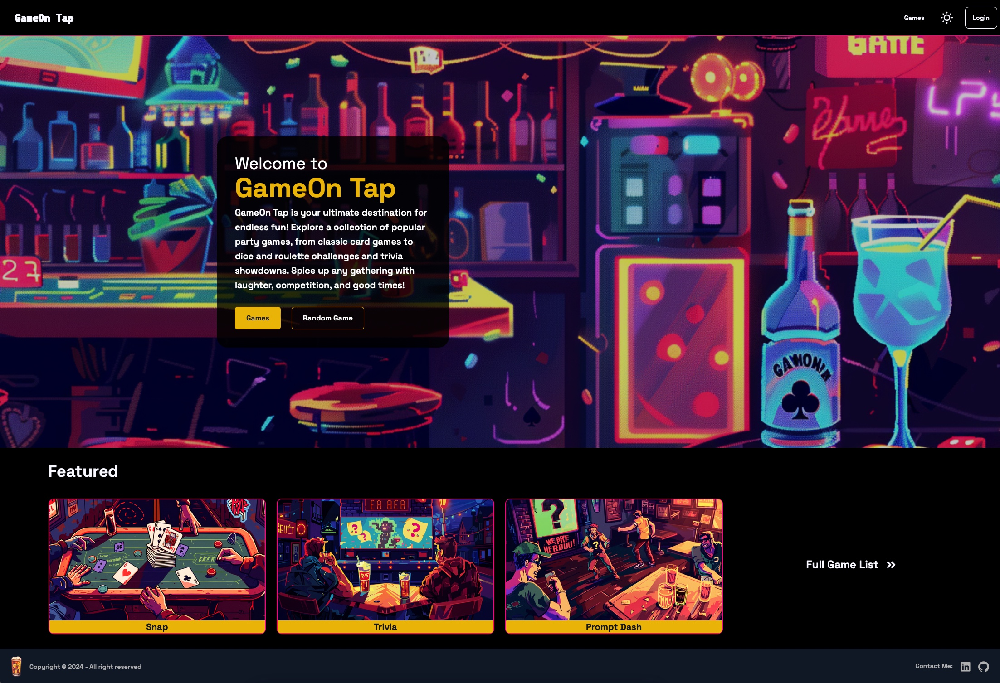
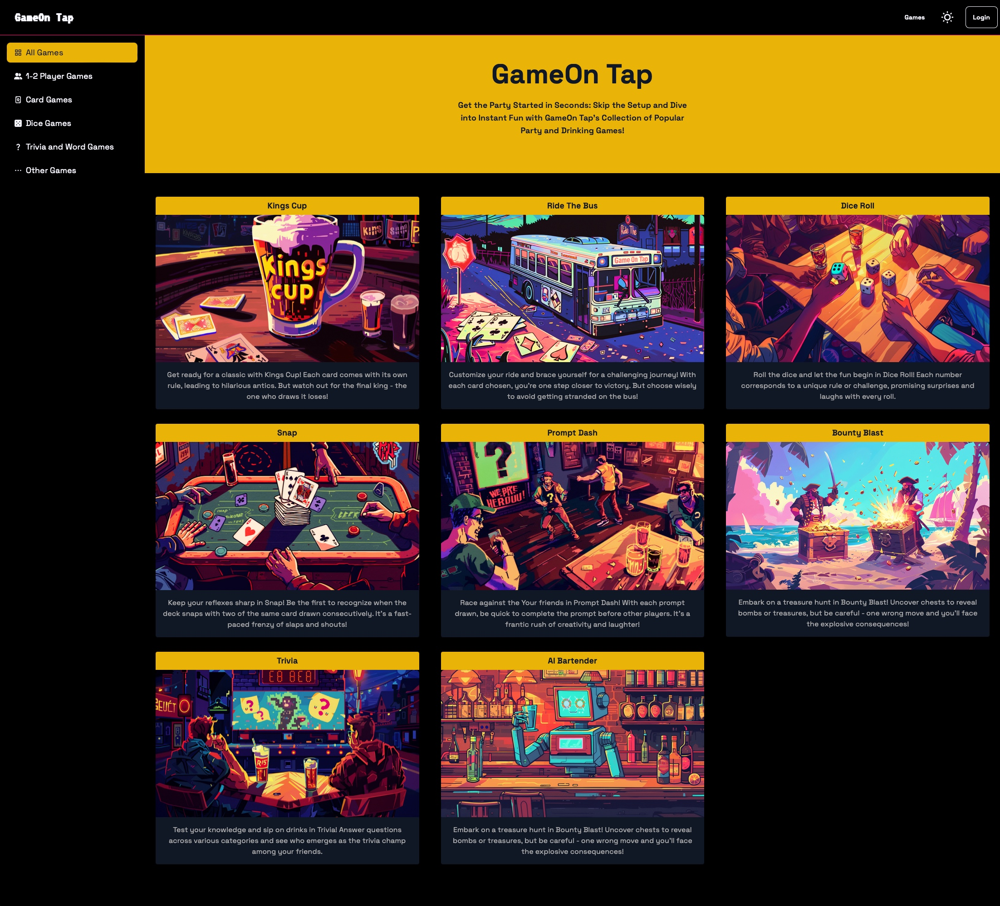

# GameOn Tap 🎲 🍻

## Live Demo: [GameOn Tap](https://www.gameontap.xyz/)

I created **GameOn Tap** to bring all the classic party games into one seamless platform. Ever found yourself in that all-too-familiar situation where you're hanging out with friends, ready for some fun, but can't decide what game to play? Or worse, nobody remembers the rules, or you're missing some key items? Yep, been there, done that. That's where the idea for GameOn Tap comes from! A one-stop hub for all your favorite party games, designed to make your game nights seamless and stress-free! Whether it's card games, dice games, or trivia showdowns. Explore the games, invite your friends, and get ready for some friendly competition!

  

## :computer: Tech stack

### Frontend 👀

- React
- JavaScript
- Tailwind CSS
- NodeJS

### Backend 🔧

- TypeScript
- Hono
- PostgreSQL
- AWS RDS
- Railway

## :heavy_plus_sign: API

- OpenAI
- Open Trivia DB

## 🍻  Features  

 

- ***Kings Cup*** 🃏
- ***Ride The Bus*** 🚌
- ***Dice Roll*** 🎲
- ***Snap*** ✋
- ***Prompt Dash*** ⏱️
- ***Bounty Blast*** 💣
- ***Trivia*** 🧠
- ***AI Bartender*** 🤖

## 👏 Credits

A huge thank you to my coach, ***Devin Marsh***, for his incredible support and guidance throughout the entire process of creating this project!
